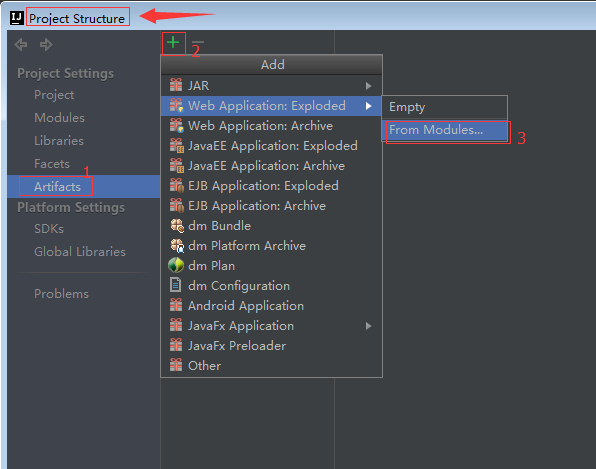

# springMVC

## 配置maven依赖

## BeanNameUrlHandlerMapping,基于控制器的名称控制url映射（不常用）
使用BeanNameUrlHandlerMapping,基于控制器的名称控制url映射，需要每写一个页面就要创建一个类继承AbstractController这个抽象类，特别麻烦
### 配置web.xml文件
```angular2html
 <!--配置springMVC-->
    <servlet>
        <servlet-name>hello</servlet-name>
        <servlet-class>org.springframework.web.servlet.DispatcherServlet</servlet-class>
    </servlet>
    <servlet-mapping>
        <servlet-name>hello</servlet-name>
        <url-pattern>/*</url-pattern>
    </servlet-mapping>

    <!--配置字符编码过滤器-->
    <filter>
        <filter-name>encoding</filter-name>
        <filter-class>org.springframework.web.filter.CharacterEncodingFilter</filter-class>
    </filter>
    <filter-mapping>
        <filter-name>encoding</filter-name>
        <url-pattern>/*</url-pattern>
    </filter-mapping>
```

### 配置springMVC的配置文件
因为上面的servlet-name是hello,所以设置springMVC的配置文件必须是hello-servlet.xml  
将这个文件放置在WEB-INF文件夹下，方便程序可以容易的找到,  
可以通过idea右键 new -> xml configuration file -> spring config 创建

### 创建视图控制器
在controller包里添加HelloController类
```angular2html
public class HelloController extends AbstractController {
    protected ModelAndView handleRequestInternal(
            HttpServletRequest httpServletRequest, HttpServletResponse httpServletResponse) throws Exception {
        System.out.println(" hello spring mvc ...");
        return null;
    }
}

```
### 在hello-servlet.xml文件中添加配置
```angular2html
    <!--BeanNameUrlHandlerMapping,根据控制器的名称控制url映射-->
    <bean name="/hello.do" class="springMVC.controller.HelloController"/>
```

## 基于注解使用映射

### 配置web.xml
```angular2html
 <servlet>
        <servlet-name>hello</servlet-name>
        <servlet-class>org.springframework.web.servlet.DispatcherServlet</servlet-class>
    </servlet>
    <servlet-mapping>
        <servlet-name>hello</servlet-name>
        <url-pattern>/</url-pattern>
    </servlet-mapping>


    <filter>
        <filter-name>encoding</filter-name>
        <filter-class>org.springframework.web.filter.CharacterEncodingFilter</filter-class>
    </filter>
    <filter-mapping>
        <filter-name>encoding</filter-name>
        <url-pattern>/*</url-pattern>
    </filter-mapping>
```

### 配置hello-servlet.xml文件
```
<?xml version="1.0" encoding="UTF-8"?>
<beans xmlns="http://www.springframework.org/schema/beans"
       xmlns:xsi="http://www.w3.org/2001/XMLSchema-instance"
       xmlns:mvc="http://www.springframework.org/schema/mvc"
       xmlns:context="http://www.springframework.org/schema/context"
       xsi:schemaLocation="http://www.springframework.org/schema/beans
       http://www.springframework.org/schema/beans/spring-beans.xsd
        http://www.springframework.org/schema/context
        http://www.springframework.org/schema/context/spring-context.xsd
         http://www.springframework.org/schema/mvc
        http://www.springframework.org/schema/mvc/spring-mvc.xsd">


    <!--基于annotation-->
    <!--开启注解支持-->
    <context:annotation-config />
    <!--在哪个包中找相关的类-->
    <context:component-scan base-package="springMVC" />

    <!--添加MVC驱动-->
    <mvc:annotation-driven />

    <!--配置视图解析器-->
    <bean class="org.springframework.web.servlet.view.InternalResourceViewResolver">
        <property name="prefix" value="/WEB-INF/page/"/>
        <property name="suffix" value=".jsp" />
    </bean>

</beans>
```
### 创建Controller类
创建Controller类添加注解@Controller  
在方法上添加@RequestMapping注解
```
@Controller("login")
public class LoginController {

    @RequestMapping(name = "/test_login")
    public String login(String username, Map<String,Object> context){
        System.out.println("传进来的参数是" + username);
        context.put("username",username);
        return "test_login";
    }

//    推荐使用
    @RequestMapping(value = "/login")
    public String login(String username, Model model){
        System.out.println(username);
//        如果model中存储的是String类型,在页面上直接用${string}就可以取到,但是用${username}是取不到的
        //model.addAttribute(username);
//        推荐使用的方法,在页面上用${username}的方法获取存入的值
        User user = new User(1,"毛晓彤","tongtong","123456");
        model.addAttribute("user",user);
        return "login";
    }
}
```

## 访问页面并向后台传入数据
http://localhost:8080/test_login?username=xiaoming


## 踩过的坑

### [2018-08-25 02:01:57,648] Artifact hellospringMVC:war exploded: Error during artifact deployment. See server log for details.
解决方案：  


### 
